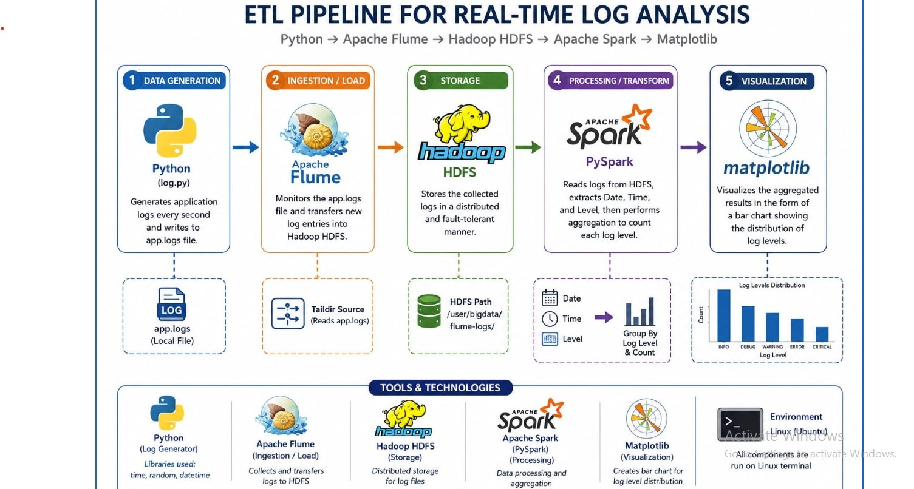

# Log_pipeline
An end-to-end data engineering project demonstrating log generation, data ingestion, ETL processing with PySpark, data storage, and visualization for analytics.

🚀 Log Pipeline with Apache Flume, Hadoop & PySpark

An end-to-end Data Engineering project that simulates real-time log generation, ingests data using Apache Flume, stores it in Hadoop HDFS, processes it with Apache Spark (PySpark), and visualizes the results using Matplotlib.

📌 Project Overview

This project demonstrates a complete Data Engineering pipeline from data generation to visualization.

Architecture

Python Log Generator │ ▼ Apache Flume │ ▼ Hadoop HDFS │ ▼ Apache Spark (PySpark) │ ▼ Data Processing (ETL) │ ▼ Matplotlib Visualization

